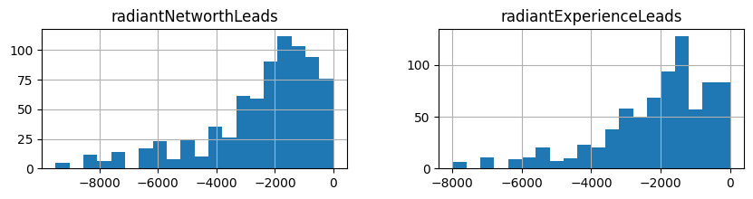
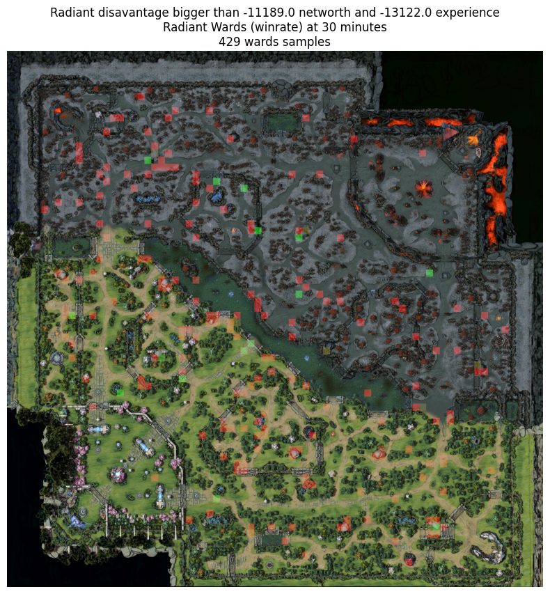

```python
import os
import pandas as pd
import numpy as np
from dotenv import load_dotenv
from PIL import Image
import matplotlib.pyplot as plt
from src.wards_data import WardDataset
```


```python
load_dotenv()

STRATZ_TOKEN = os.getenv('STRATZ_TOKEN')
if not STRATZ_TOKEN:
    raise FileNotFoundError("Not found STRATZ_TOKEN on .env")

ward_dataset = WardDataset(STRATZ_TOKEN)
```


```python
df_data = ward_dataset.get_full_dataset()
df_data
```

    warning: no wards found for match 7813469345
    


<div>
<style scoped>
    .dataframe tbody tr th:only-of-type {
        vertical-align: middle;
    }

    .dataframe tbody tr th {
        vertical-align: top;
    }

    .dataframe thead th {
        text-align: right;
    }
</style>
<table border="1" class="dataframe">
  <thead>
    <tr style="text-align: right;">
      <th></th>
      <th>time</th>
      <th>radiantNetworthLeads</th>
      <th>radiantExperienceLeads</th>
      <th>radiantKills</th>
      <th>direKills</th>
      <th>match</th>
      <th>durationMinutes</th>
      <th>didRadiantWin</th>
      <th>startDateTime</th>
      <th>firstBloodTime</th>
      <th>...</th>
      <th>leagueName</th>
      <th>id</th>
      <th>positionX</th>
      <th>positionY</th>
      <th>wardType</th>
      <th>isRadiant</th>
      <th>playerDestroyed</th>
      <th>radiantTeam</th>
      <th>direTeam</th>
      <th>didWardWin</th>
    </tr>
  </thead>
  <tbody>
    <tr>
      <th>0</th>
      <td>-2</td>
      <td>0</td>
      <td>0</td>
      <td>0</td>
      <td>0</td>
      <td>7811671022</td>
      <td>40</td>
      <td>True</td>
      <td>1719161556</td>
      <td>93</td>
      <td>...</td>
      <td>Road To The International 2024  - Regional Qua...</td>
      <td>7811671022_450</td>
      <td>38</td>
      <td>36</td>
      <td>OBSERVER</td>
      <td>True</td>
      <td>None</td>
      <td>Tundra Esports</td>
      <td>PSG.Quest</td>
      <td>True</td>
    </tr>
    <tr>
      <th>1</th>
      <td>-2</td>
      <td>0</td>
      <td>0</td>
      <td>0</td>
      <td>0</td>
      <td>7811671022</td>
      <td>40</td>
      <td>True</td>
      <td>1719161556</td>
      <td>93</td>
      <td>...</td>
      <td>Road To The International 2024  - Regional Qua...</td>
      <td>7811671022_454</td>
      <td>52</td>
      <td>23</td>
      <td>OBSERVER</td>
      <td>True</td>
      <td>None</td>
      <td>Tundra Esports</td>
      <td>PSG.Quest</td>
      <td>True</td>
    </tr>
    <tr>
      <th>2</th>
      <td>-1</td>
      <td>50</td>
      <td>0</td>
      <td>0</td>
      <td>0</td>
      <td>7811671022</td>
      <td>40</td>
      <td>True</td>
      <td>1719161556</td>
      <td>93</td>
      <td>...</td>
      <td>Road To The International 2024  - Regional Qua...</td>
      <td>7811671022_450</td>
      <td>38</td>
      <td>36</td>
      <td>OBSERVER</td>
      <td>True</td>
      <td>None</td>
      <td>Tundra Esports</td>
      <td>PSG.Quest</td>
      <td>True</td>
    </tr>
    <tr>
      <th>3</th>
      <td>-1</td>
      <td>50</td>
      <td>0</td>
      <td>0</td>
      <td>0</td>
      <td>7811671022</td>
      <td>40</td>
      <td>True</td>
      <td>1719161556</td>
      <td>93</td>
      <td>...</td>
      <td>Road To The International 2024  - Regional Qua...</td>
      <td>7811671022_454</td>
      <td>52</td>
      <td>23</td>
      <td>OBSERVER</td>
      <td>True</td>
      <td>None</td>
      <td>Tundra Esports</td>
      <td>PSG.Quest</td>
      <td>True</td>
    </tr>
    <tr>
      <th>4</th>
      <td>-1</td>
      <td>50</td>
      <td>0</td>
      <td>0</td>
      <td>0</td>
      <td>7811671022</td>
      <td>40</td>
      <td>True</td>
      <td>1719161556</td>
      <td>93</td>
      <td>...</td>
      <td>Road To The International 2024  - Regional Qua...</td>
      <td>7811671022_459</td>
      <td>35</td>
      <td>34</td>
      <td>OBSERVER</td>
      <td>False</td>
      <td>None</td>
      <td>Tundra Esports</td>
      <td>PSG.Quest</td>
      <td>False</td>
    </tr>
    <tr>
      <th>...</th>
      <td>...</td>
      <td>...</td>
      <td>...</td>
      <td>...</td>
      <td>...</td>
      <td>...</td>
      <td>...</td>
      <td>...</td>
      <td>...</td>
      <td>...</td>
      <td>...</td>
      <td>...</td>
      <td>...</td>
      <td>...</td>
      <td>...</td>
      <td>...</td>
      <td>...</td>
      <td>...</td>
      <td>...</td>
      <td>...</td>
      <td>...</td>
    </tr>
    <tr>
      <th>176909</th>
      <td>52</td>
      <td>-23868</td>
      <td>-33980</td>
      <td>4</td>
      <td>1</td>
      <td>7812389654</td>
      <td>53</td>
      <td>False</td>
      <td>1719206407</td>
      <td>6</td>
      <td>...</td>
      <td>Elite League Season 2 SEA Closed Qualifiers – ...</td>
      <td>7812389654_4604</td>
      <td>22</td>
      <td>32</td>
      <td>SENTRY</td>
      <td>True</td>
      <td>None</td>
      <td>Yangon Galacticos</td>
      <td>Neon Esports</td>
      <td>False</td>
    </tr>
    <tr>
      <th>176910</th>
      <td>52</td>
      <td>-23868</td>
      <td>-33980</td>
      <td>4</td>
      <td>1</td>
      <td>7812389654</td>
      <td>53</td>
      <td>False</td>
      <td>1719206407</td>
      <td>6</td>
      <td>...</td>
      <td>Elite League Season 2 SEA Closed Qualifiers – ...</td>
      <td>7812389654_4559</td>
      <td>41</td>
      <td>19</td>
      <td>SENTRY</td>
      <td>False</td>
      <td>None</td>
      <td>Yangon Galacticos</td>
      <td>Neon Esports</td>
      <td>True</td>
    </tr>
    <tr>
      <th>176911</th>
      <td>52</td>
      <td>-23868</td>
      <td>-33980</td>
      <td>4</td>
      <td>1</td>
      <td>7812389654</td>
      <td>53</td>
      <td>False</td>
      <td>1719206407</td>
      <td>6</td>
      <td>...</td>
      <td>Elite League Season 2 SEA Closed Qualifiers – ...</td>
      <td>7812389654_411</td>
      <td>43</td>
      <td>49</td>
      <td>OBSERVER</td>
      <td>True</td>
      <td>None</td>
      <td>Yangon Galacticos</td>
      <td>Neon Esports</td>
      <td>False</td>
    </tr>
    <tr>
      <th>176912</th>
      <td>52</td>
      <td>-23868</td>
      <td>-33980</td>
      <td>4</td>
      <td>1</td>
      <td>7812389654</td>
      <td>53</td>
      <td>False</td>
      <td>1719206407</td>
      <td>6</td>
      <td>...</td>
      <td>Elite League Season 2 SEA Closed Qualifiers – ...</td>
      <td>7812389654_2292</td>
      <td>43</td>
      <td>49</td>
      <td>SENTRY</td>
      <td>True</td>
      <td>None</td>
      <td>Yangon Galacticos</td>
      <td>Neon Esports</td>
      <td>False</td>
    </tr>
    <tr>
      <th>176913</th>
      <td>52</td>
      <td>-23868</td>
      <td>-33980</td>
      <td>4</td>
      <td>1</td>
      <td>7812389654</td>
      <td>53</td>
      <td>False</td>
      <td>1719206407</td>
      <td>6</td>
      <td>...</td>
      <td>Elite League Season 2 SEA Closed Qualifiers – ...</td>
      <td>7812389654_2956</td>
      <td>23</td>
      <td>21</td>
      <td>SENTRY</td>
      <td>True</td>
      <td>None</td>
      <td>Yangon Galacticos</td>
      <td>Neon Esports</td>
      <td>False</td>
    </tr>
  </tbody>
</table>
<p>176914 rows × 22 columns</p>
</div>


```python
len(df_data['match'].unique())
```


    426


```python
df_data['leagueName'].unique()
```


    array(['Road To The International 2024  - Regional Qualifiers Western Europe',
           'Road To The International 2024  - Regional Qualifiers Southeast Asia',
           'Road To The International 2024  - Regional Qualifiers South America',
           'Road To The International 2024 - Regional Qualifiers Eastern Europe',
           'Road To The International 2024 - Regional Qualifiers China',
           'Road To The International 2024  - Regional Qualifiers North America',
           'Elite League Season 2 EEU Closed Qualifiers – presented by ESB',
           'Elite League Season 2 WEU Closed Qualifiers – presented by ESB',
           'Elite League Season 2 SA Closed Qualifiers – presented by ESB',
           'Elite League Season 2 NA Closed Qualifiers – presented by ESB',
           'Elite League Season 2 CN Closed Qualifiers – presented by ESB',
           'Elite League Season 2 SEA Closed Qualifiers – presented by ESB'],
          dtype=object)


```python
BG_MAP_SIZE = np.array((5000, 5000))
```


```python

import matplotlib.patches as mpatches
map_size = (df_data['positionY'].max()+5, df_data['positionX'].max()+5)
def wards_hotmap(df: pd.DataFrame):
    
    # load bg_map
    bg_map = np.array(Image.open('assets\Game_map_7.33.webp').resize(BG_MAP_SIZE))

    positionX = df['positionX']
    positionY = df['positionY']
    isRadiant = df['isRadiant']
    didWardWin = df['didWardWin']
    
    
    map = np.zeros((map_size[0], map_size[1], 3))

    for px, py, is_radiant, did_ward_win in zip(positionX, positionY, isRadiant, didWardWin):
        color_channels = (False,True,False) if is_radiant else (True,False,False)
        # print(map[py, px, color_channels])
        map[py, px, color_channels] += 1 # if did_ward_win else -1
    map = np.clip(map * 1., a_min=0, a_max=float("+inf"))
    #map[:,:,0] = (map[:,:,0] * 255.) // map[:,:,0].max()
    #map[:,:,1] = (map[:,:,1] * 255.) // map[:,:,1].max()
    #map[:,:,2] = (map[:,:,2] * 255.) // map[:,:,2].max()
    map = (map * 255) // map.max()
    map = np.flip(map, axis=0)
    map_to_pil = map.astype(np.uint8)
    map = np.array(Image.fromarray(map_to_pil).resize(BG_MAP_SIZE, resample=Image.Resampling.LANCZOS))
    map = np.clip(map * 1., a_min=0, a_max=230)
    
    map_alpha = map / 255

    merged_map = map * map_alpha + bg_map * (1 - map_alpha)
    merged_map = np.array(merged_map, dtype=np.uint8)

    return merged_map

mask = df_data['wardType'] == "OBSERVER"

df_observer = df_data[mask].reset_index()

sample = pd.concat([
    df_observer.iloc[df_observer['positionX'].idxmax()].to_frame().T,
    df_observer.iloc[df_observer['positionX'].idxmin()].to_frame().T,
    df_observer.iloc[df_observer['positionY'].idxmax()].to_frame().T,
    df_observer.iloc[df_observer['positionY'].idxmin()].to_frame().T,
])

plt.figure(figsize=(10,10))
plt.imshow(wards_hotmap(sample))
plt.title("Most extreme coordinates wards")
```


    Text(0.5, 1.0, 'Most extreme coordinates wards')


    

    


```python
plt.figure(figsize=(10,10), dpi=100)
plt.axis('off')
plt.title("Most frequent wards")

# Create custom legend patches
legend_patches = [
    mpatches.Patch(color='#90ee90', label='Radiant'),
    mpatches.Patch(color='red', label='Dire'),
    mpatches.Patch(color='yellow', label='Both')
]

# Add legend to the plot
plt.legend(handles=legend_patches, loc='upper right')

plt.imshow(wards_hotmap(df_observer))
plt.show()
```


    

    


```python
df_observer_radiant_disavantage = df_observer[(df_observer['radiantNetworthLeads'] < 0) & (df_observer['radiantExperienceLeads'] < 0)]
df_observer_radiant_disavantage[df_observer_radiant_disavantage['time']%10==0].groupby("time")[['radiantNetworthLeads','radiantExperienceLeads']].hist(bins=20, figsize=(10,2))

```


    time
    0     [[Axes(0.125,0.11;0.336957x0.77), Axes(0.56304...
    10    [[Axes(0.125,0.11;0.336957x0.77), Axes(0.56304...
    20    [[Axes(0.125,0.11;0.336957x0.77), Axes(0.56304...
    30    [[Axes(0.125,0.11;0.336957x0.77), Axes(0.56304...
    40    [[Axes(0.125,0.11;0.336957x0.77), Axes(0.56304...
    50    [[Axes(0.125,0.11;0.336957x0.77), Axes(0.56304...
    60    [[Axes(0.125,0.11;0.336957x0.77), Axes(0.56304...
    70    [[Axes(0.125,0.11;0.336957x0.77), Axes(0.56304...
    Name: (radiantNetworthLeads, radiantExperienceLeads), dtype: object


    

    


    

    


    

    


    

    


    

    


    

    


    

    


    

    


```python
dis_median = df_observer_radiant_disavantage.groupby("time")[['radiantNetworthLeads', 'radiantExperienceLeads']].median()
dis_median_mask = df_observer_radiant_disavantage.apply(
    lambda row: (row['radiantNetworthLeads'] > dis_median.loc[row['time']]['radiantNetworthLeads'])
                & (row['radiantExperienceLeads'] > dis_median.loc[row['time']]['radiantExperienceLeads']), axis=1)
df_observer_radiant_disavantage_masked = df_observer_radiant_disavantage[dis_median_mask]
```


```python
df_observer = df_observer.drop_duplicates(['id']).reset_index()
df_observer
```


<div>
<style scoped>
    .dataframe tbody tr th:only-of-type {
        vertical-align: middle;
    }

    .dataframe tbody tr th {
        vertical-align: top;
    }

    .dataframe thead th {
        text-align: right;
    }
</style>
<table border="1" class="dataframe">
  <thead>
    <tr style="text-align: right;">
      <th></th>
      <th>level_0</th>
      <th>index</th>
      <th>time</th>
      <th>radiantNetworthLeads</th>
      <th>radiantExperienceLeads</th>
      <th>radiantKills</th>
      <th>direKills</th>
      <th>match</th>
      <th>durationMinutes</th>
      <th>didRadiantWin</th>
      <th>...</th>
      <th>leagueName</th>
      <th>id</th>
      <th>positionX</th>
      <th>positionY</th>
      <th>wardType</th>
      <th>isRadiant</th>
      <th>playerDestroyed</th>
      <th>radiantTeam</th>
      <th>direTeam</th>
      <th>didWardWin</th>
    </tr>
  </thead>
  <tbody>
    <tr>
      <th>0</th>
      <td>0</td>
      <td>0</td>
      <td>-2</td>
      <td>0</td>
      <td>0</td>
      <td>0</td>
      <td>0</td>
      <td>7811671022</td>
      <td>40</td>
      <td>True</td>
      <td>...</td>
      <td>Road To The International 2024  - Regional Qua...</td>
      <td>7811671022_450</td>
      <td>38</td>
      <td>36</td>
      <td>OBSERVER</td>
      <td>True</td>
      <td>None</td>
      <td>Tundra Esports</td>
      <td>PSG.Quest</td>
      <td>True</td>
    </tr>
    <tr>
      <th>1</th>
      <td>1</td>
      <td>1</td>
      <td>-2</td>
      <td>0</td>
      <td>0</td>
      <td>0</td>
      <td>0</td>
      <td>7811671022</td>
      <td>40</td>
      <td>True</td>
      <td>...</td>
      <td>Road To The International 2024  - Regional Qua...</td>
      <td>7811671022_454</td>
      <td>52</td>
      <td>23</td>
      <td>OBSERVER</td>
      <td>True</td>
      <td>None</td>
      <td>Tundra Esports</td>
      <td>PSG.Quest</td>
      <td>True</td>
    </tr>
    <tr>
      <th>2</th>
      <td>4</td>
      <td>4</td>
      <td>-1</td>
      <td>50</td>
      <td>0</td>
      <td>0</td>
      <td>0</td>
      <td>7811671022</td>
      <td>40</td>
      <td>True</td>
      <td>...</td>
      <td>Road To The International 2024  - Regional Qua...</td>
      <td>7811671022_459</td>
      <td>35</td>
      <td>34</td>
      <td>OBSERVER</td>
      <td>False</td>
      <td>None</td>
      <td>Tundra Esports</td>
      <td>PSG.Quest</td>
      <td>False</td>
    </tr>
    <tr>
      <th>3</th>
      <td>5</td>
      <td>5</td>
      <td>-1</td>
      <td>50</td>
      <td>0</td>
      <td>0</td>
      <td>0</td>
      <td>7811671022</td>
      <td>40</td>
      <td>True</td>
      <td>...</td>
      <td>Road To The International 2024  - Regional Qua...</td>
      <td>7811671022_517</td>
      <td>44</td>
      <td>14</td>
      <td>OBSERVER</td>
      <td>False</td>
      <td>None</td>
      <td>Tundra Esports</td>
      <td>PSG.Quest</td>
      <td>False</td>
    </tr>
    <tr>
      <th>4</th>
      <td>24</td>
      <td>44</td>
      <td>4</td>
      <td>1133</td>
      <td>447</td>
      <td>1</td>
      <td>0</td>
      <td>7811671022</td>
      <td>40</td>
      <td>True</td>
      <td>...</td>
      <td>Road To The International 2024  - Regional Qua...</td>
      <td>7811671022_881</td>
      <td>36</td>
      <td>37</td>
      <td>OBSERVER</td>
      <td>False</td>
      <td>None</td>
      <td>Tundra Esports</td>
      <td>PSG.Quest</td>
      <td>False</td>
    </tr>
    <tr>
      <th>...</th>
      <td>...</td>
      <td>...</td>
      <td>...</td>
      <td>...</td>
      <td>...</td>
      <td>...</td>
      <td>...</td>
      <td>...</td>
      <td>...</td>
      <td>...</td>
      <td>...</td>
      <td>...</td>
      <td>...</td>
      <td>...</td>
      <td>...</td>
      <td>...</td>
      <td>...</td>
      <td>...</td>
      <td>...</td>
      <td>...</td>
      <td>...</td>
    </tr>
    <tr>
      <th>13301</th>
      <td>62149</td>
      <td>176851</td>
      <td>45</td>
      <td>-13691</td>
      <td>-14597</td>
      <td>0</td>
      <td>0</td>
      <td>7812389654</td>
      <td>53</td>
      <td>False</td>
      <td>...</td>
      <td>Elite League Season 2 SEA Closed Qualifiers – ...</td>
      <td>7812389654_3225</td>
      <td>22</td>
      <td>33</td>
      <td>OBSERVER</td>
      <td>False</td>
      <td>None</td>
      <td>Yangon Galacticos</td>
      <td>Neon Esports</td>
      <td>True</td>
    </tr>
    <tr>
      <th>13302</th>
      <td>62158</td>
      <td>176879</td>
      <td>48</td>
      <td>-25238</td>
      <td>-21979</td>
      <td>0</td>
      <td>0</td>
      <td>7812389654</td>
      <td>53</td>
      <td>False</td>
      <td>...</td>
      <td>Elite League Season 2 SEA Closed Qualifiers – ...</td>
      <td>7812389654_4494</td>
      <td>26</td>
      <td>8</td>
      <td>OBSERVER</td>
      <td>True</td>
      <td>None</td>
      <td>Yangon Galacticos</td>
      <td>Neon Esports</td>
      <td>False</td>
    </tr>
    <tr>
      <th>13303</th>
      <td>62161</td>
      <td>176886</td>
      <td>49</td>
      <td>-26731</td>
      <td>-33320</td>
      <td>1</td>
      <td>1</td>
      <td>7812389654</td>
      <td>53</td>
      <td>False</td>
      <td>...</td>
      <td>Elite League Season 2 SEA Closed Qualifiers – ...</td>
      <td>7812389654_3743</td>
      <td>34</td>
      <td>28</td>
      <td>OBSERVER</td>
      <td>False</td>
      <td>None</td>
      <td>Yangon Galacticos</td>
      <td>Neon Esports</td>
      <td>True</td>
    </tr>
    <tr>
      <th>13304</th>
      <td>62162</td>
      <td>176888</td>
      <td>49</td>
      <td>-26731</td>
      <td>-33320</td>
      <td>1</td>
      <td>1</td>
      <td>7812389654</td>
      <td>53</td>
      <td>False</td>
      <td>...</td>
      <td>Elite League Season 2 SEA Closed Qualifiers – ...</td>
      <td>7812389654_4582</td>
      <td>22</td>
      <td>32</td>
      <td>OBSERVER</td>
      <td>True</td>
      <td>None</td>
      <td>Yangon Galacticos</td>
      <td>Neon Esports</td>
      <td>False</td>
    </tr>
    <tr>
      <th>13305</th>
      <td>62167</td>
      <td>176904</td>
      <td>51</td>
      <td>-19322</td>
      <td>-28482</td>
      <td>0</td>
      <td>1</td>
      <td>7812389654</td>
      <td>53</td>
      <td>False</td>
      <td>...</td>
      <td>Elite League Season 2 SEA Closed Qualifiers – ...</td>
      <td>7812389654_411</td>
      <td>43</td>
      <td>49</td>
      <td>OBSERVER</td>
      <td>True</td>
      <td>None</td>
      <td>Yangon Galacticos</td>
      <td>Neon Esports</td>
      <td>False</td>
    </tr>
  </tbody>
</table>
<p>13306 rows × 24 columns</p>
</div>


```python
df_observer['isRadiant'].astype(int).plot(kind='hist')
```


    <Axes: ylabel='Frequency'>


    

    


```python
# df_observer['score'] = df_observer['didWardWin'].map(lambda x: 1 if x == True else 0)
grouped_score = df_observer_radiant_disavantage.groupby(['time', 'positionX', 'positionY', 'isRadiant'])['didWardWin']
df_scores = grouped_score.count().reset_index(name="wardCount")
df_scores['wins'] = grouped_score.sum().reset_index()['didWardWin']
# df_scores = grouped_score.sum().to_frame()
# df_scores = df_scores.reset_index()
# df_scores[['wards_count']].plot(kind='hist', bins=12, alpha=0.5)
df_scores['winRate'] = df_scores['wins'] /  df_scores['wardCount']
df_scores
```


<div>
<style scoped>
    .dataframe tbody tr th:only-of-type {
        vertical-align: middle;
    }

    .dataframe tbody tr th {
        vertical-align: top;
    }

    .dataframe thead th {
        text-align: right;
    }
</style>
<table border="1" class="dataframe">
  <thead>
    <tr style="text-align: right;">
      <th></th>
      <th>time</th>
      <th>positionX</th>
      <th>positionY</th>
      <th>isRadiant</th>
      <th>wardCount</th>
      <th>wins</th>
      <th>winRate</th>
    </tr>
  </thead>
  <tbody>
    <tr>
      <th>0</th>
      <td>-1</td>
      <td>21</td>
      <td>33</td>
      <td>False</td>
      <td>1</td>
      <td>1</td>
      <td>1.0</td>
    </tr>
    <tr>
      <th>1</th>
      <td>-1</td>
      <td>22</td>
      <td>42</td>
      <td>False</td>
      <td>1</td>
      <td>1</td>
      <td>1.0</td>
    </tr>
    <tr>
      <th>2</th>
      <td>-1</td>
      <td>22</td>
      <td>43</td>
      <td>False</td>
      <td>1</td>
      <td>0</td>
      <td>0.0</td>
    </tr>
    <tr>
      <th>3</th>
      <td>-1</td>
      <td>23</td>
      <td>42</td>
      <td>False</td>
      <td>1</td>
      <td>0</td>
      <td>0.0</td>
    </tr>
    <tr>
      <th>4</th>
      <td>-1</td>
      <td>23</td>
      <td>42</td>
      <td>True</td>
      <td>1</td>
      <td>1</td>
      <td>1.0</td>
    </tr>
    <tr>
      <th>...</th>
      <td>...</td>
      <td>...</td>
      <td>...</td>
      <td>...</td>
      <td>...</td>
      <td>...</td>
      <td>...</td>
    </tr>
    <tr>
      <th>16670</th>
      <td>74</td>
      <td>22</td>
      <td>33</td>
      <td>True</td>
      <td>1</td>
      <td>0</td>
      <td>0.0</td>
    </tr>
    <tr>
      <th>16671</th>
      <td>74</td>
      <td>24</td>
      <td>19</td>
      <td>False</td>
      <td>1</td>
      <td>1</td>
      <td>1.0</td>
    </tr>
    <tr>
      <th>16672</th>
      <td>74</td>
      <td>33</td>
      <td>24</td>
      <td>False</td>
      <td>1</td>
      <td>1</td>
      <td>1.0</td>
    </tr>
    <tr>
      <th>16673</th>
      <td>74</td>
      <td>34</td>
      <td>17</td>
      <td>False</td>
      <td>1</td>
      <td>1</td>
      <td>1.0</td>
    </tr>
    <tr>
      <th>16674</th>
      <td>74</td>
      <td>41</td>
      <td>19</td>
      <td>True</td>
      <td>1</td>
      <td>0</td>
      <td>0.0</td>
    </tr>
  </tbody>
</table>
<p>16675 rows × 7 columns</p>
</div>


```python
df_scores[['winRate']].plot(kind='hist', title="Winrate distribution before mask")
```


    <Axes: title={'center': 'Winrate distribution before mask'}, ylabel='Frequency'>


    

    


```python
mask = df_scores['wardCount'] > 0 # df_scores['wardCount'].mean()
df_scores_masked = df_scores[mask]
df_scores_masked[['winRate']].plot(kind='hist', title="Winrate distribution after mask")
df_scores['wardCount'].mean()
```


    1.4820389805097451


    

    


```python
(df_scores_masked['wardCount'] / df_scores_masked['wardCount'].max()).plot(kind='hist', title="wardCount / max(wardCount)")
```


    <Axes: title={'center': 'wardCount / max(wardCount)'}, ylabel='Frequency'>


    

    


```python
import matplotlib.colors as mcolors
import matplotlib.cm as cm

def rescale_pixel(map, factor=1, limit=255):
    max_value = np.max(map, axis=2)
    mask = max_value > 0
    max_factor = np.zeros_like(max_value)
    max_factor[mask] = limit / max_value[mask]
    curr_factor = max_factor
    curr_factor_mask = factor < max_factor
    curr_factor[curr_factor_mask] = factor
    return map * curr_factor[:, :, np.newaxis] 

def wards_hotmap_winrate(df: pd.DataFrame):
    
    # load bg_map
    bg_map = np.array(Image.open('assets\Game_map_7.33.webp').resize(BG_MAP_SIZE).convert('RGBA'))

    positionX = df['positionX']
    positionY = df['positionY']
    winRate = df['winRate']
    wardCount = df['wardCount']
    
    # get blank arr map
    
    map = np.zeros((map_size[0], map_size[1], 4))

    for px, py, win_rate, ward_count in zip(positionX, positionY, winRate, wardCount):
        red = (1 - win_rate) * 255
        green = win_rate * 255
        alpha = ward_count
        blue = 0
        map[py, px] = (red, green, blue, alpha)

    map = np.clip(map * 1., a_min=0, a_max=float("+inf"))
    map[:,:,3] = (map[:,:,3] * 255) // (map[:,:,3].max() * 10)
    map = np.flip(map, axis=0)
    map = rescale_pixel(map, 1, 195)
    
    map_to_pil = map.astype(np.uint8)
    map = np.array(Image.fromarray(map_to_pil, 'RGBA').resize(BG_MAP_SIZE, resample=Image.Resampling.NEAREST))
    # map = np.clip(map * 1., a_min=0, a_max=195)
    map_alpha = map / 255

    merged_map = map * map_alpha + bg_map * (1 - map_alpha)
    merged_map = np.array(merged_map, dtype=np.uint8)

    return merged_map


for time, group in df_scores_masked.query('time % 10 == 0 & time < 60').groupby("time"):
    plt.figure(figsize=(10,10), dpi=100)
    plt.axis('off')
    net_lead = dis_median.loc[time]['radiantNetworthLeads']
    xp_lead = dis_median.loc[time]['radiantExperienceLeads']
    plt.title(f"Radiant disavantage bigger than {net_lead} networth and {xp_lead} experience\nRadiant Wards (winrate) at {time} minutes\n{group.shape[0]} wards samples")
    plt.imshow(wards_hotmap_winrate(group.query('isRadiant == True')))

```


    

    


    

    


    

    


    

    


    

    


    

    


```python
df_scores_masked.sort_values("wardCount", ascending=False)
```


<div>
<style scoped>
    .dataframe tbody tr th:only-of-type {
        vertical-align: middle;
    }

    .dataframe tbody tr th {
        vertical-align: top;
    }

    .dataframe thead th {
        text-align: right;
    }
</style>
<table border="1" class="dataframe">
  <thead>
    <tr style="text-align: right;">
      <th></th>
      <th>time</th>
      <th>positionX</th>
      <th>positionY</th>
      <th>isRadiant</th>
      <th>wardCount</th>
      <th>wins</th>
      <th>winRate</th>
    </tr>
  </thead>
  <tbody>
    <tr>
      <th>3358</th>
      <td>10</td>
      <td>54</td>
      <td>18</td>
      <td>False</td>
      <td>15</td>
      <td>12</td>
      <td>0.800000</td>
    </tr>
    <tr>
      <th>2621</th>
      <td>9</td>
      <td>22</td>
      <td>48</td>
      <td>False</td>
      <td>15</td>
      <td>10</td>
      <td>0.666667</td>
    </tr>
    <tr>
      <th>2005</th>
      <td>7</td>
      <td>38</td>
      <td>30</td>
      <td>True</td>
      <td>15</td>
      <td>3</td>
      <td>0.200000</td>
    </tr>
    <tr>
      <th>3041</th>
      <td>10</td>
      <td>22</td>
      <td>48</td>
      <td>False</td>
      <td>14</td>
      <td>10</td>
      <td>0.714286</td>
    </tr>
    <tr>
      <th>2936</th>
      <td>9</td>
      <td>54</td>
      <td>18</td>
      <td>False</td>
      <td>14</td>
      <td>10</td>
      <td>0.714286</td>
    </tr>
    <tr>
      <th>...</th>
      <td>...</td>
      <td>...</td>
      <td>...</td>
      <td>...</td>
      <td>...</td>
      <td>...</td>
      <td>...</td>
    </tr>
    <tr>
      <th>6795</th>
      <td>19</td>
      <td>15</td>
      <td>41</td>
      <td>False</td>
      <td>1</td>
      <td>1</td>
      <td>1.000000</td>
    </tr>
    <tr>
      <th>6796</th>
      <td>19</td>
      <td>15</td>
      <td>51</td>
      <td>True</td>
      <td>1</td>
      <td>0</td>
      <td>0.000000</td>
    </tr>
    <tr>
      <th>6797</th>
      <td>19</td>
      <td>15</td>
      <td>54</td>
      <td>True</td>
      <td>1</td>
      <td>0</td>
      <td>0.000000</td>
    </tr>
    <tr>
      <th>6801</th>
      <td>19</td>
      <td>16</td>
      <td>29</td>
      <td>False</td>
      <td>1</td>
      <td>1</td>
      <td>1.000000</td>
    </tr>
    <tr>
      <th>16674</th>
      <td>74</td>
      <td>41</td>
      <td>19</td>
      <td>True</td>
      <td>1</td>
      <td>0</td>
      <td>0.000000</td>
    </tr>
  </tbody>
</table>
<p>16675 rows × 7 columns</p>
</div>


## tensor


```python
import torch
device = 'cuda' if torch.cuda.is_available() else 'cpu'
device
```


    'cuda'


```python
torch.tensor
```


    <function torch._VariableFunctionsClass.tensor>


